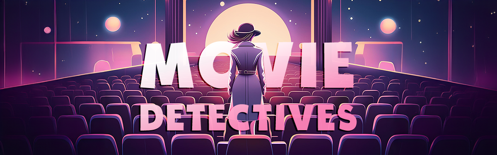
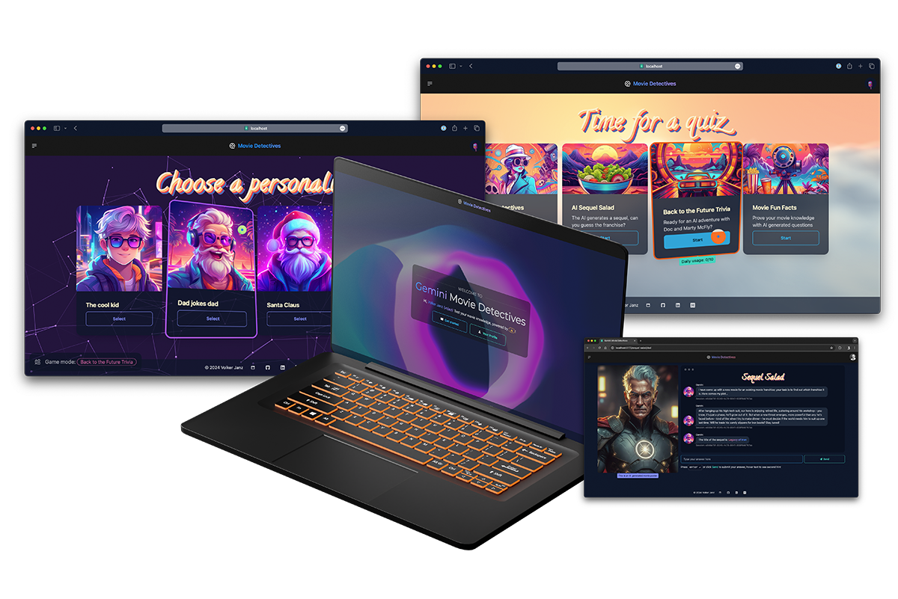
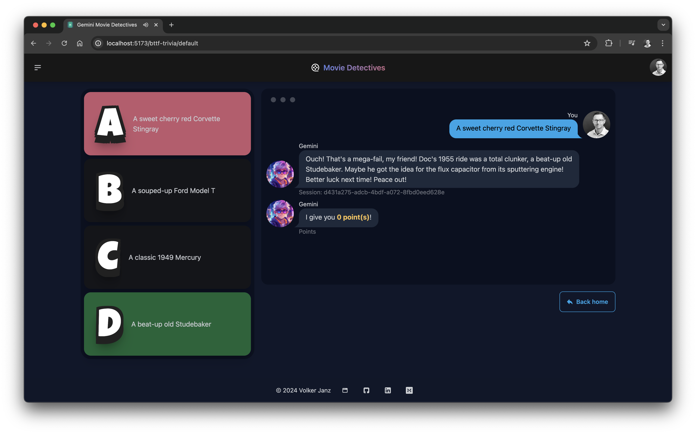
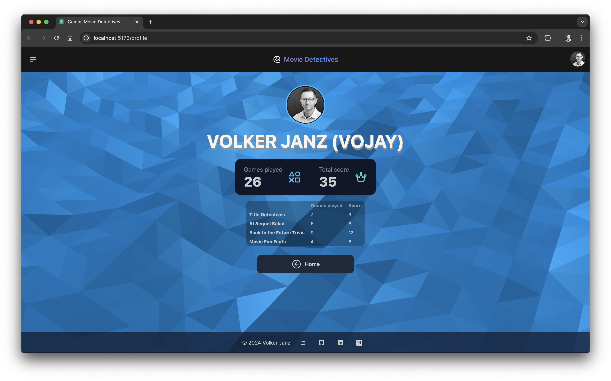
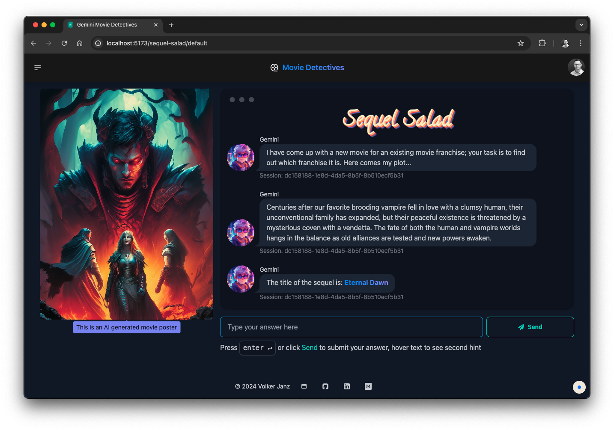
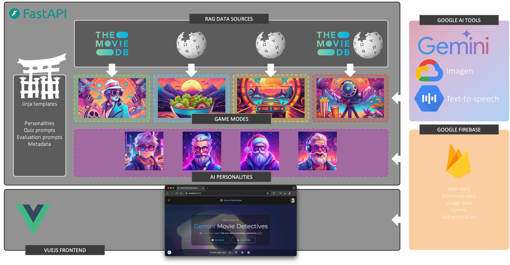
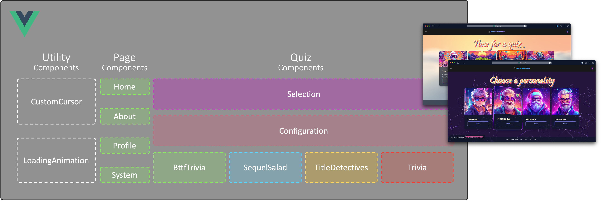

# Gemini Movie Detectives UI



Gemini Movie Detectives harnesses Google's AI to revolutionize educational gaming, transforming movie trivia
into a proof-of-concept gateway for AI-driven, adaptive learning across all subjects, challenging your inner
movie nerd while showcasing how AI can reshape education in schools and universities.

**Try it yourself**: [movie-detectives.com](https://movie-detectives.com/)

## Backend

The backend infrastructure is built with FastAPI and Python, employing the Retrieval-Augmented Generation (RAG)
methodology to enrich queries with real-time metadata. Utilizing Jinja templating, the backend modularizes
prompt generation into base, personality, and data enhancement templates, enabling the generation of accurate
and engaging quiz questions in different game modes. Each game mode uses a different combination of data source
showcasing the broad range of possibilities how to employ advanced Gemini applications.

In addition to Gemini, the application leverages Google's state-of-the-art Text-to-Speech AI to synthesize quiz
questions, dramatically enhancing the immersive atmosphere of a professional trivia game show. Moreover, the
Sequel Salad game mode demonstrates the power of AI integration by utilizing Gemini to generate creative prompts.
These prompts are then seamlessly fed into Google's cutting-edge Imagen text-to-image diffusion model, producing
fake movie posters. This sophisticated interplay of various AI models showcases the limitless potential for
creating captivating and dynamic game experiences, pushing the boundaries of what's possible in interactive
entertainment.

The application's infrastructure is further strengthened by the integration of Google Firebase. This integration
enables secure user authentication, facilitating personalized interactions within the app. Firestore is used to
store and manage essential user data, powering the dynamic rendering of user profiles with game statistics.
Additionally, it handles crucial metadata, including movie franchise information and game mode usage metrics
together with configurable limits, allowing for precise control over daily operational costs.

## Frontend

The frontend is powered by Vue 3 and Vite, supported by daisyUI and Tailwind CSS for efficient frontend
development. Together, these tools provide users with a sleek and modern interface for seamless interaction
with the backend.

## Summary

In Movie Detectives, quiz answers are interpreted by the Language Model (LLM) once again, allowing for dynamic
scoring and personalized responses. This showcases the potential of integrating LLM with RAG in game design and
development, paving the way for truly individualized gaming experiences. Furthermore, it demonstrates the
potential for creating engaging quiz trivia or educational games by involving LLM. Adding and changing personalities
is as easy as adding more Jinja template modules. With very little effort, this can change the full game experience,
reducing the effort for developers. Try it yourself and change the AI personality in the quiz configuration.

Movie Detectives tackles the challenge of maintaining student interest, improving knowledge retention, and making
learning enjoyable. It's not just a movie quiz; it’s a glimpse into AI-enhanced education, pushing boundaries
for accessible, engaging, and effective learning experiences.



---

## Examples


*Game mode: Back to the Future Trivia*


*User profile*


*Game mode: Sequel Salad*

---

**Backend**: [gemini-movie-detectives-api](https://github.com/vojay-dev/gemini-movie-detectives-api)

## Tech stack and project overview

- [VueJS](https://vuejs.org/) 3.4 for frontend development
- [Vite](https://vitejs.dev/) for frontend tooling
- [Firebase](https://firebase.google.com/) for user authentication
- [Tailwind CSS](https://tailwindcss.com/) as a utility-first CSS framework
- [daisyUI](https://daisyui.com/) as a component library for Tailwind CSS
- [Vue Flow](https://vueflow.dev/) for flowcharts and graphs 


*Movie Detectives - System Overview*

The frontend experience is best on desktop browser *but* everything is responsive using Tailwind CSS and daisyUI so
all quiz modes and pages can be used on mobile as well.

## Quiz client

Even though Movie Detectives offers different game modes, all of them are handled via the same start and finish quiz
endpoints. To reduce code duplication, there is a centralized quiz client in `src/quiz.js`.

## Components


*Components*

The frontend is separated into the following components:

- 📚 **Quiz Components**
  - Selection: Component to select a game mode
  - Configuration: Personality configuration for the selected game mode
  - TitleDetectives: Title Detectives game mode
  - SequelSalad: Sequel Salad game mode
  - BttfTrivia: Back to the Future Trivia game mode
  - Trivia: Movie Fun Facts game mode
- 📄 **Page Components**
  - Home: Start page
  - About: About page with basic project information
  - System: System overview implemented with Vue Flow
  - Profile: Profile page for authenticated users
- ⚙️ **Utility Components**
  - CustomCursor: Custom cursor implementation
  - LoadingAnimation: Loading animation with customizable loading text

## Project setup

Ensure to configure the correct API endpoint for local or live usage in `src/config.js`.

```sh
npm install
```

## Run

```sh
npm run dev
```

## Build

```sh
npm run build
```
