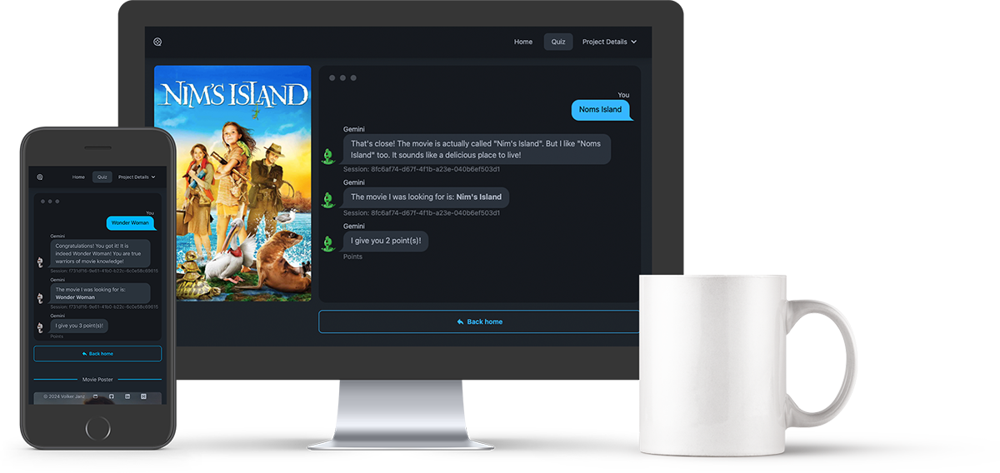
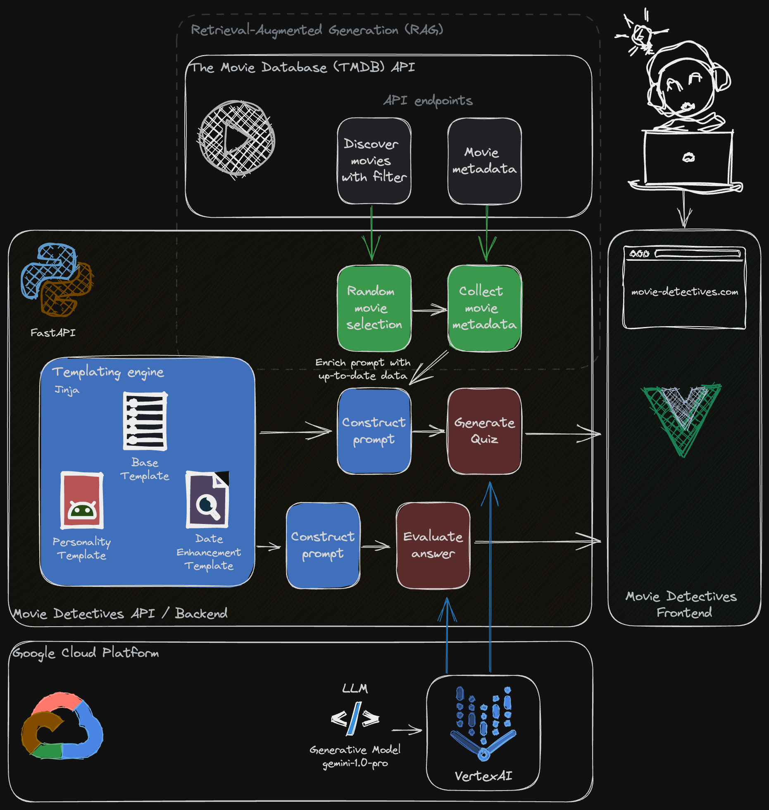

# Gemini Movie Detectives UI

**This project was created as part of the [Google AI Hackathon 2024](https://googleai.devpost.com/)**.


Gemini Movie Detectives is a project aimed at leveraging the power of the Gemini 1.0 Pro model via VertexAI to
create an engaging quiz game using the latest movie data from The Movie Database (TMDB).

Try it yourself: [movie-detectives.com](https://movie-detectives.com/)

## Backend

The backend infrastructure is built with FastAPI and Python, employing the Retrieval-Augmented Generation (RAG)
methodology to enrich queries with real-time metadata. Utilizing Jinja templating, the backend modularizes
prompt generation into base, personality, and data enhancement templates, enabling the generation of accurate
and engaging quiz questions.

## Frontend

The frontend is powered by Vue 3 and Vite, supported by daisyUI and Tailwind CSS for efficient frontend
development. Together, these tools provide users with a sleek and modern interface for seamless interaction
with the backend.

## Summary

In Movie Detectives, quiz answers are interpreted by the Language Model (LLM) once again, allowing for dynamic
scoring and personalized responses. This showcases the potential of integrating LLM with RAG in game design and
development, paving the way for truly individualized gaming experiences. Furthermore, it demonstrates the
potential for creating engaging quiz trivia or educational games by involving LLM. Adding and changing personalities
or languages is as easy as adding more Jinja template modules. With very little effort, this can change the
full game experience, reducing the effort for developers. Try it yourself and change the AI personality
in the quiz configuration.



Backend: [gemini-movie-detectives-api](https://github.com/vojay-dev/gemini-movie-detectives-api)

## Project overview

- VueJS 3.4
- Vite


*Movie Detectives - System Overview*

## Project setup

```sh
npm install
```

## Run

```sh
npm run dev
```

## Build

```sh
npm run build
```
